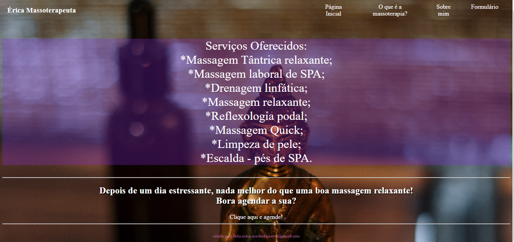

<h1 align="center"> Site Érica Massoterapeuta </h1>

Projeto de site responsivo.

  <a href="#-tecnologias">Tecnologias</a>&nbsp;&nbsp;&nbsp;|&nbsp;&nbsp;&nbsp;
  <a href="#-projeto">Projeto</a>&nbsp;&nbsp;&nbsp;|&nbsp;&nbsp;&nbsp;
  <a href="#-layout">layout</a>&nbsp;&nbsp;

 

  

## 🚀 Tecnologias

Esse projeto foi desenvolvido com as seguintes tecnologias:

- HTML e CSS
- Git e Github
- JavaScript

## 💻 Projeto

Site desenvolvido com foco em informações relacionadas a massoterapia. Pode ser acessado no notebook, computador e celular.

## 🔖 Modelo de site

Você pode visualizar o rascunho do projeto através [DESSE LINK](https://sites.google.com/view/erica-massoterapeuta/home).
